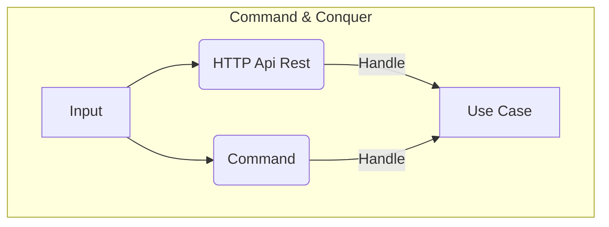

# Welcome to NExp Refactoring Examples!

    

## Basic Description
Welcome! 

This repository represents the evolution of Node Experience code and how we can move from simple example code.

Master branch on this repository contain the first example and every extra branch will represent 
every refactoring until came up to NExp official.

## Real Base project

https://github.com/DigiChanges/node-experience

## Quick Start

We can run the project directly with docker compose and then bash where the basic commands to feed the database are located.

1. Install dependencies. `pnpm install`.
2. Copy `.env.dev` file to `.env`. (**.env.dev** it's a environment example file)
3. Then execute `pnpm dev` to execute nodeJS program and up Koa Server.
4. This repository use mongoose therefore they should have the database installed to run it.

## Architecture

## License

**NExp** is [MIT licensed](LICENSE).
